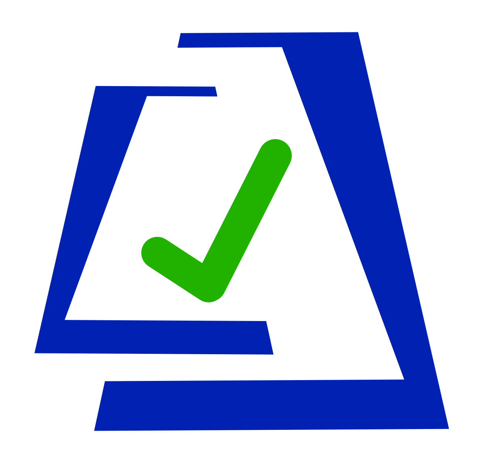

# Gate Check



Gate Check automates report validation in a CI/CD Pipeline by comparing security findings to a pre-determined 
thresholds.
It also provides report aggregation, artifact integrity, and deployment validation.
Gate Check is stateless so self-hosting and provisioning servers is not required.

## Upcoming Features

- [X] Report Aggregation
- [X] Vulnerability Threshold Configuration
- [ ] Asset bundling
- [ ] Artifact Integrity Verification
- [ ] Whitelist Management
- [ ] Deployment Verification & Validation

## Getting started

The fastest way to get started with Gate Check is to download the pre-built binaries for your target system.

```shell
cd <target install dir>
curl -L <OS Specific Release>.tar.gz | tar xz
./gatecheck
./gatecheck --help
```

Gate Check uses Cobra for the CLI, so the normal convention of using ```--help``` to see command usage works.

To generate a configuration file with the default thresholds set

```shell
gatecheck config init .
cat gatecheck.yaml
```

Add a grype report 

```shell
gatecheck report add grype grype-report.json
gatecheck report print
```

**Note** You can specify specific config files or report files with ```--config FILE``` and/or ```--report FILE``` 
respectively.
Without the flags, it will look for ```gatecheck.yaml``` and ```gatecheck-report.json``` in the working directory

Add additional information to a report
```shell
gatecheck report update --report gatecheck-report.json --url "gitlab.com/piplineid" --id "abc-12345"
gatecheck report print --report gatecheck-report.json
```

If you want to apply a modified configuration file to the report, it can be done like so:
```shell
gatecheck report update --report gatecheck-report.json --config custom-config.yaml
gatecheck report print --report gatecheck-report.json
```

## Exporting

Exporting will take the report and upload it to a specific target location using the API.
Custom exporters can be created by simply implementing the Exporter interface.

### Defect Dojo

[Defect Dojo Documentation](https://defectdojo.github.io/django-DefectDojo/)

The Product Type, Product, and Engagement will be automatically created on export.
These variables must be supplied as environment variables.
Currently, the exporter uses the `/import-scan` endpoint in the Defect Dojo API

Environment Variables:
- GATECHECK_DD_API_KEY
- GATECHECK_DD_API_URL
- GATECHECK_DD_PRODUCT_TYPE
- GATECHECK_DD_PRODUCT
- GATECHECK_DD_ENGAGEMENT
- GATECHECK_DD_COMMIT_HASH
- GATECHECK_DD_BRANCH_TAG
- GATECHECK_DD_SOURCE_URL

## Types

With dozens of popular security and software tools, Gate Check abstracts the terminology.

### Config

The configuration file has the threshold for each artifact.
The Gate Check config (```gatecheck.yaml``` by default) is a customizable collection of tool specific configuration 
files.
This file is where the thresholds are set.

### Report

The final report summary that contains the aggregated data used for verification.
```gatecheck-report.json``` by default.
This is a summary of the data collected from the output reports from other tools.

### Artifact

The converted scan output or report from a specific third party tool.
This is the Gate Check internal representation of an output report which is abstracted so it can be output in a 
variety of formats.

### Asset

The raw file used to create the artifact or configuration.
Gate Check will bundle all assets and verify the integrity of the files using RSA signing. 