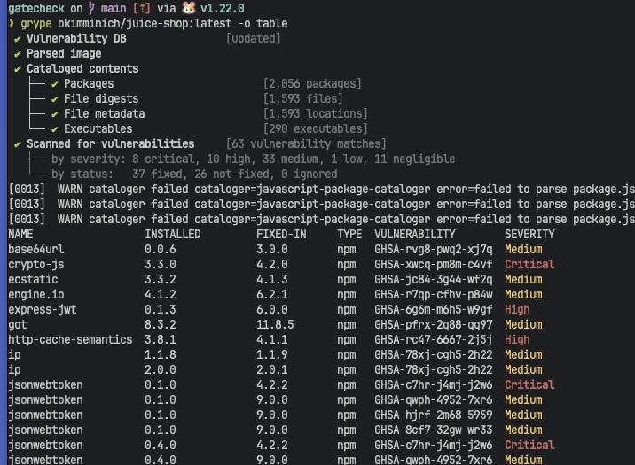
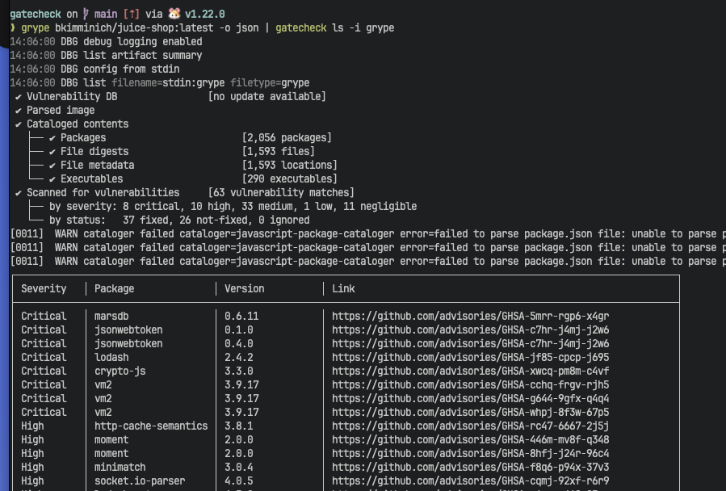
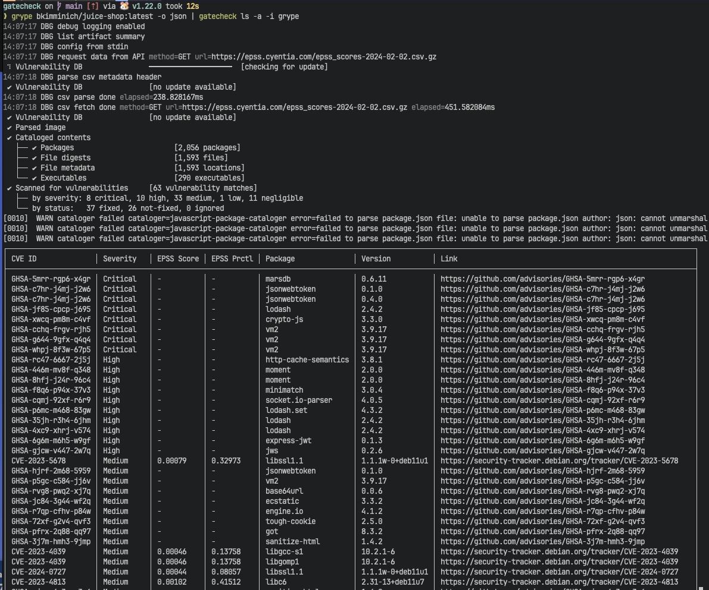

# List Reports

Most scanning tools have options to display a formatted report.
Take Grype for example:

```shell
grype bkimminich/juice-shop:latest -o table
```


The report can be printed in a formatted table instead of 6k line JSON file.

JSON can be piped directly into gatecheck for supported reports.

```shell
grype bkimminich/juice-shop:latest -o json | gatecheck ls -i grype
```
Or from an existing report

```shell
gatecheck ls grype-scan-report.json
```



Using the `--all` or `-a` flag will do a full listing, cross-referencing with FIRST EPSS API

```shell
grype bkimminich/juice-shop:latest -o json | gatecheck ls --all -i grype
```


