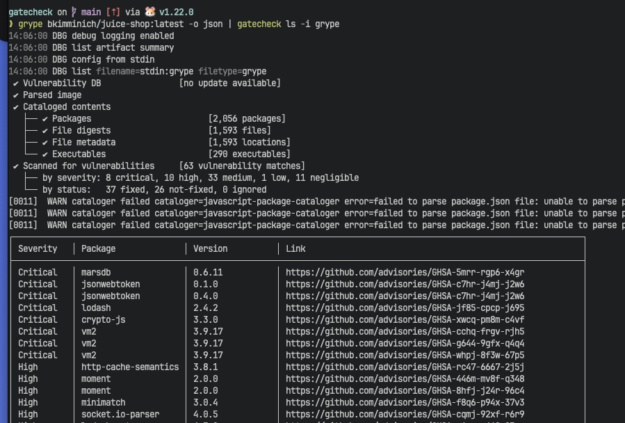

# List Reports

Gatecheck can list contents of supported reports in a human-readable format.

Example with Grype:

```
grype image:tag -o json | gatecheck list --input-type grype
```

Or from file:

```
gatecheck list grype-report.json
```

Supports Grype, Cyclonedx, Semgrep, Gitleaks, etc.

